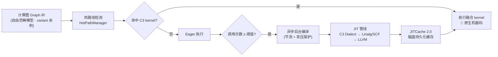
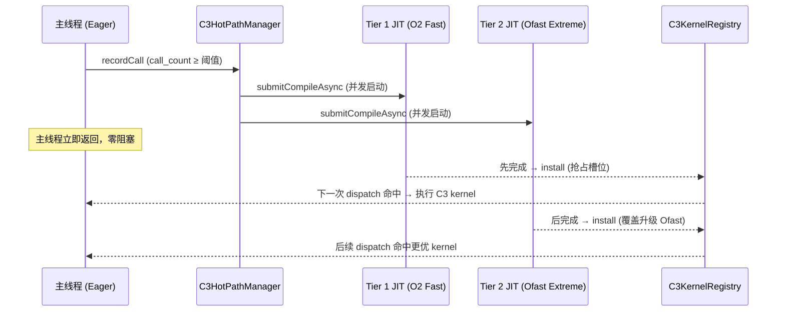

<div align="center">

# C3 — CTorch 异步非阻塞编译器

[](./LICENSE)
[]()
[]()
[]()

**把「热路径」编译成机器码的即时编译器 · 图级融合 · 端到端加速**

C3 是 CTorch 深度学习框架的 **JIT 计算编译器**：它嗅探计算图中的热路径，把
`MatMul + Add + ReLU` 这样的算子序列**声明式地融合成单个 kernel**，再用
MLIR / LLVM 现场编译为机器码，透明替换 Eager 执行。

`CTorch Compute Compiler`

<p align="center">
  <b>单核注入&nbsp;&nbsp;•&nbsp;&nbsp;区域融合&nbsp;&nbsp;•&nbsp;&nbsp;反向融合</b><br/>
  <b>全自动编排&nbsp;&nbsp;•&nbsp;&nbsp;持久化缓存&nbsp;&nbsp;•&nbsp;&nbsp;PGO 两阶段</b>
</p>

</div>

---

## ✨ 核心亮点

<div align="center">

|         特性          | 描述                                              |
| :-------------------: | ------------------------------------------------- |
| **端到端 5.92× 加速** | MNIST MLP 训练端到端 **5.92× 提速**，精度零损失   |
|   **三层递进融合**    | 逐层捕获可融合热路径，最大化计算强度              |
|  **异步双管线编译**   | O2 极速抢占 + Ofast 渐进式升级，主线程零阻塞      |
| **自适应抢占注册**    | 谁先完成谁先上，更高优化级自动热替换覆盖          |
|    **全自动编排**     | 热路径检测 → 异步编译 → 自动安装 → Eager 无感切换 |
|    **持久化缓存**     | JITCache 2.0 把编译产物落盘，跨进程冷启动即热     |
|  **PGO 两阶段编译**   | 解释器起步，热路径自动提升到编译模式              |
|    **多后端支持**     | CPU（LLVM JIT）+ 海光 DCU（gfx906 / GCVM，可选）  |
|   **物理独立仓库**    | 宿主类型直用，与 XLA/Triton 同设计哲学            |

</div>

---

## 端到端性能基准

> `test_c3_mnist_train` — MLP (784→256→128→10, 5 epochs × 128 batch, Apple Silicon MPS)

<div align="center">

|         指标          |    C3 启用     | Eager 原生 |    加速比     |
| :-------------------: | :------------: | :--------: | :-----------: |
|    **总训练时间**     |   **7.98 s**   |  47.26 s   |   **5.92×**   |
|   **最终测试精度**    |   **97.18%**   |   97.18%   | ⚖️ **零损失** |
| **MatMul/Add 等价性** | `max_diff = 0` |     —      |  ✅ 位级一致  |

<small>融合统计：区域融合 <code>fused_hit ≈ 936/epoch</code>，反向融合 <code>bw_hit = 11692</code>（约 55% 反向工作量被融合）</small>

</div>

---

## 架构与管线

### 完整工作流



### 三代 JIT 管线演进

|    世代     | 后端路径                                                   | 实现方式                                  | 当前状态  |
| :---------: | ---------------------------------------------------------- | ----------------------------------------- | :-------: |
| **JIT 1.0** | 手写 C++ kernel + clang++ 落盘                             | JIT 1.0 初代原型                          | 🗑️ 已退役 |
| **JIT 2.0** | 自研 C3 Dialect (TableGen) + `linalg.generic` 声明式逐元素 | TableGen 自动生成 Dialect，MLIR 标准降层  |  ✅ 生产  |
| **JIT 3.0** | One-Shot Linalg 融合管线                                   | C3 Dialect → Linalg 融合 → SCF → LLVM JIT |  ✅ 生产  |

### 核心模块结构

```
C3/
├── CMakeLists.txt              # 独立构建入口
├── include/C3/                 # 公共头文件
│   ├── Graph.h                 # 计算图 IR（余积类型 Node）
│   ├── C3Engine.h              # 编译引擎入口
│   ├── C3HotPathManager.h      # 热路径自动检测
│   ├── C3KernelRegistry.h      # 融合 kernel 注册表
│   ├── C3Config.h              # 运行时开关配置
│   ├── RegionFusion.h          # 区域融合定义
│   ├── C3BackwardCapture.h     # 反向融合捕获
│   ├── LinalgElementwiseGen.h  # 声明式逐元素 kernel（8 种算子）
│   ├── LinalgOneShotGen.h      # 3.0 One-Shot 融合生成器
│   ├── C3Dialect.h / C3Ops.td  # 自研 C3 Dialect 定义
│   ├── JITCache.h              # 磁盘持久化缓存
│   ├── PGOManager.h            # PGO 性能引导编译
│   ├── GraphMerger.h           # 子图合并
│   └── RollingHash.h           # 图哈希（缓存 key 生成）
└── src/C3/                     # 实现源码
    ├── C3DialectLowering.cpp   # C3 Dialect 到 Linalg 降层
    ├── DCUCompiledKernel.cpp   # 海光 DCU 后端（可选）
    └── ...
```

---

## 异步双管线编译与自适应抢占注册

### 双管线并发编译

当热路径检测到调用次数达到阈值后，`C3HotPathManager` 会对同一 `(op, shape)` **同时提交两条并发编译管线**：

|       管线        |       优化级别        |        目标        |          注册时机           |
| :---------------: | :-------------------: | :----------------: | :-------------------------: |
| **Tier 1 JIT**    | `O2` 极速编译响应     | 尽快交付可用 kernel | 🥇 先完成 → 先抢占注册       |
| **Tier 2 JIT**    | `Ofast` Passes 全开（Loop Unroll-and-Jam、寄存器最大复用） | 极致性能 kernel | 🥈 后完成 → 覆盖升级 |

- 两条管线通过 `std::async(std::launch::async)` **并发运行**，主线程零阻塞 —— 这正是「异步非阻塞」的根基；
- 编译 future 纳入全局生命周期管理（`pending_futures_`），防止进程退出 UAF；
- Tier 1 优先让程序**尽快跑上编译 kernel**，Tier 2 随后用更优的机器码**渐进式增强**。



### 自适应抢占注册

注册即生效的**热替换**，配以**自适应节流**避免编译风暴：

- **原子热替换**：`install` 后立即生效（下一次 dispatch 原子可见），无需重启或手动切换；
- **抢占槽位**：双管线**谁先完成谁先抢占** registry 槽位，后完成的更高优化级 kernel 自动覆盖升级；
- **自动回退**：未命中 / 形状不匹配 → 静默回退 Eager（预期行为）；执行异常 → 回退 + 记录日志 + 可选自动卸载；
- **自适应节流**（`HotPathConfig`，可运行时调整）：

|          参数           |  默认值  |                 作用                  |
| :---------------------: | :------: | :-----------------------------------: |
|   `hot_threshold`       |    5     |    调用次数达到阈值才触发异步编译     |
|    `cooldown_sec`       |    60    | 同一 key 编译后进入冷却期，避免重复编译 |
|    `max_pending`        |    16    | 待编译队列达到上限进入背压，自动跳过新请求 |
| `compile_timeout_ms`    |  30000   |            单次编译超时保护             |

- 节流与背压均可观测（`cooldown_hits` / `backpressure_hits` 统计），便于调优。

---

## 🚀 快速开始

### 作为 CTorch 子模块（推荐使用方式）

```bash
# 克隆 CTorch 时自动初始化 C3 子模块
git clone --recurse-submodules git@github.com:ShengFlow/CTorch.git
cd CTorch
mkdir build && cd build
cmake ..
make -j$(nproc)
```

### 独立构建验证

C3 仓库不携带宿主头文件（Tensor/Ctools/Node 来自 CTorch），通过 `C3_HOST_INCLUDE_DIRS` 传入宿主搜索路径：

```bash
# 依赖：MLIR/LLVM 18+（macOS: brew install llvm）
cmake -S . -B build \
  -DCT_ENABLE_MLIR=ON \
  -DC3_HOST_INCLUDE_DIRS="/path/to/CTorch/include;/path/to/CTorch/src"

cmake --build build --target C3Core -j$(nproc)
```

> 💡 编译优化配置与宿主保持一致：**C++20 · `-O3 -ffast-math -march=native` · Thin LTO**（默认开启）。

---

## 运行时配置

每个子功能支持**两级开关**：编译期 CMake option + 运行时环境变量，任一关闭即关闭。查询接口短路且缓存 static 结果，避免热路径重复开销。

| 环境变量                     |                     功能                      |     默认     |
| :--------------------------- | :-------------------------------------------: | :----------: |
| `C3_DISABLE_SINGLE_KERNEL=1` |           关闭单 kernel 热路径注入            |    ✅ 开     |
| `C3_DISABLE_REGION_FUSION=1` |          关闭区域融合（序列级融合）           |    ✅ 开     |
| `C3_DISABLE_BACKWARD=1`      |             关闭反向传播算子融合              |    ✅ 开     |
| `C3_DISABLE_HOTPATH=1`       |         关闭热路径检测与自动编译触发          |    ✅ 开     |
| `C3_LINALG_EW=0`             | 关闭声明式 linalg 逐元素 kernel，回退手写路径 |    ✅ 开     |
| `C3_AOT_CACHE_DIR=<dir>`     |             指定 JIT 磁盘缓存目录             | `~/.c3cache` |

CMake 选项：

- `CT_DISABLE_C3=ON` — 整体禁用 C3（跳过所有 JIT 编译与融合）
- `CT_ENABLE_MLIR=ON/OFF` — 启用/禁用 MLIR 后端
- `CT_ENABLE_DCU=ON/OFF` — 启用/禁用海光 DCU 后端

---

## 🧭 设计理念

> **C3 不是一个完整框架，而是 CTorch 的**「编译器插件」**。**

- **物理独立 + 宿主类型直用**：C3 直接 `#include "Tensor.h"`，不做 C3Host 抽象层——与 XLA / Triton 一致的「编译器贴近宿主」哲学，换取最直接的降层路径和最少的抽象开销。
- **声明式优先**：算子融合用 `linalg.generic` / 自研 Dialect **声明「是什么」**，由 MLIR 标准 lowering 管线负责「怎么做」，最终机器码质量交给 LLVM。
- **图论打底**：Graph IR 基于自由范畴模型，`std::variant` 余积类型安全建模算子，catamorphism 实现可插拔规范化，避免虚函数表开销。

---

## 🗺️ 开发路线图

### 已完成 ✅

- [x] C3Core 独立 OBJECT 库
- [x] 独立 CMake 构建入口
- [x] 物理拆分独立仓库
- [x] CTorch 子模块挂载
- [x] 8 种逐元素算子 linalg 声明式生成
- [x] JITCache 2.0 磁盘持久化缓存

### 进行中 🚧

- [ ] 宿主类型解耦（Tensor/Ctools 下沉到 .cpp，仅保留薄接口）
- [ ] 多维广播 linalg 路径全量覆盖
- [ ] 文档完善与示例补充

### 长期目标 🎯

- [ ] **2027 CGO 投稿冲刺**
- [ ] 更多算子类型的 One-Shot 融合
- [ ] 自动调优 QEA 引擎完善
- [ ] 进程级异步支持

---

## 集成到宿主项目

C3 作为独立 OBJECT 库设计，宿主 CMake 可以这样集成：

```cmake
# 在你的 CMakeLists.txt 中
add_subdirectory(c3)  # C3 独立仓库

# 把 C3Core 对象链接到你的主库
target_sources(YourMainLibrary PUBLIC $<TARGET_OBJECTS:C3Core>)
target_include_directories(YourMainLibrary PUBLIC ${CMAKE_CURRENT_SOURCE_DIR}/c3/include)
```

详细集成说明见 [`CMakeLists.txt`](./CMakeLists.txt) 注释。

---

## 许可证

[MIT License](./LICENSE)

---

<div align="center">

**C3** · CTorch Compute Compiler · 让每一段热路径都跑在最优的机器码上

---

[](https://github.com/ShengFlow/C3)

</div>
